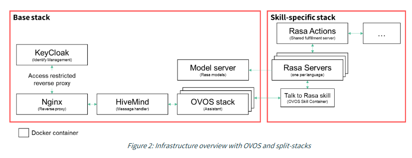

Os projetos europeus **[COALA](https://coala-ai.de)** e **[WASABI](https://wasabiproject.eu)** construíram toda uma framework de assistente de voz industrial sobre o **[OpenVoiceOS](https://openvoiceos.org)** (uma plataforma de voz de código aberto sem fins lucrativos) e o **[HiveMind](https://jarbashivemind.github.io/HiveMind-community-docs/)**, integrando-os com a sua própria interface Android, motor de NLP e stack Docker.

Não estive envolvido nestas implementações. É esse o ponto: a stack está a ser adotada pelos seus próprios méritos, por equipas com requisitos industriais reais.

---

## Concurso Aberto WASABI

O 2.º [Concurso Aberto WASABI](https://wasabiproject.eu/wp-content/uploads/2025/08/WASABI_Guide_for_Applicants_2nd-OC_vFIN.pdf) para prestar apoio financeiro a pelo menos 10 experiências lideradas por PME encerrou recentemente.
Este concurso aberto está concebido para apoiar experiências de assistência digital baseadas em IA envolvendo PME da indústria transformadora.

Todas as experiências do Concurso Aberto WASABI são obrigadas a:

* correr a **stack Docker OVOS da WASABI/COALA**
* ligar-se via **HiveMind**
* desenvolver uma **Skill OVOS** personalizada contendo a sua lógica industrial

A utilização do OVOS/HiveMind é explicada nestes 2 documentos do projeto WASABI:
- [Deliverable D2.1](https://wasabiproject.eu/wp-content/uploads/2024/01/WASABI_D2.1_template_v0.7_FINAL.pdf)
- [Deliverable D2.4](https://files.wasabiproject.eu/wp-content/uploads/2023/Docs/wp2/Deliverables/D2.4/WASABI_D2.4_Joint%20WASABI%20Demonstrator_v0.5_final.pdf)

---

## Exemplos de Aplicações Industriais

### **1. Orientação de Trabalhadores e Apoio à Montagem**

Experiências como a **[TICONAI](https://wasabiproject.eu/ticonai-2)** e a **[SKITE](https://wasabiproject.eu/skite-main-2)** usam skills OVOS para orientar os trabalhadores durante tarefas complexas, como montar componentes, validar procedimentos ou fornecer instruções passo a passo sem usar as mãos.

### **2. Controlo de Qualidade e Redução de Erros**

Projetos como a **[WALLABI](https://wasabiproject.eu/wallabi)** e a **[HUMANENERDIA](https://wasabiproject.eu/humanenerdia)** focam-se em fornecer aos trabalhadores instruções e listas de verificação em tempo real para prevenir erros. Os assistentes de voz ajudam os operadores a verificar configurações, recordar verificações de segurança ou confirmar parâmetros.

### **3. Assistência à Manutenção Preditiva**

Experiências como a **[GENIUS-PM](https://wasabiproject.eu/genius-pm)** usam o assistente para dar aos técnicos de manutenção acesso rápido a dados de saúde das máquinas, explicações de falhas e passos de reparação — especialmente quando têm as mãos ocupadas.

### **4. Logística, Movimentação de Materiais e Apoio ao Armazém**

A **[VELO](https://wasabiproject.eu/velo-2)** e a **[AIVEA](https://wasabiproject.eu/aivea)** usam a voz para ajudar os trabalhadores a localizar artigos, confirmar inventário ou verificar tarefas de entrega enquanto se movimentam pelo chão de fábrica.

### **5. Integração e Formação**

A **[ONBOARD](https://wasabiproject.eu/onboard)** e a **[AI-MODE](https://wasabiproject.eu/ai-mode)** testam como os novos colaboradores podem ser orientados através de tarefas usando orientação por voz, reduzindo a carga sobre os supervisores.

### **6. Sustentabilidade, Rastreio de Resíduos e Eficiência de Recursos**

A **[VAFER](https://wasabiproject.eu/vafer)** integra interfaces de voz com sistemas que monitorizam a reciclagem, a reutilização de materiais e os fluxos de recursos — reporte sem usar as mãos em ambientes fabris.

Tudo isto depende do OVOS e do HiveMind para encaminhar a comunicação entre dispositivos, interface Android e sistemas de backend.

---

## O Que a COALA/WASABI Construiu Sobre o OVOS

Embora os projetos não tenham produzido skills industriais de código aberto, criaram vários componentes em torno do OVOS + HiveMind:

### **1. Um Assistente de Domínio (DA) baseado em RASA**

A investigação inicial da COALA desenvolveu um **pipeline de NLP RASA** treinado com conversas da indústria transformadora (sobre verificações de qualidade, resolução de problemas, operação de máquinas).
Na WASABI, este motor RASA está ligado ao OVOS como uma **skill**, tratando do diálogo específico do domínio.

### **2. A Aplicação Android COALA**

Um front-end Android para os trabalhadores, ligando-se ao OVOS através do HiveMind.

Versão inicial lançada aqui:
[https://github.com/BIBA-GmbH/Mycroft-Android](https://github.com/BIBA-GmbH/Mycroft-Android)

As funcionalidades incluem:

* login via Keycloak
* chat por texto ou voz
* interface para instruções, avisos e notas
* mensagens baseadas em HiveMind

### **3. Uma Stack Industrial Completa Baseada em Docker**

Ambos os projetos disponibilizam um ambiente Docker pré-configurado que reúne:

* OVOS
* HiveMind
* Keycloak (gestão de utilizadores)
* motor de NLP RASA
* serviços de conector COALA

Isto forma a stack padrão de assistente de voz industrial que todas as experiências WASABI têm de implementar.

### **4. Um Dataset de Fala Industrial**

A COALA publicou um dataset de fala multilingue gravado em fábricas e oficinas:
[https://zenodo.org/record/8268928](https://zenodo.org/record/8268928)

---

## Porque a Indústria Escolhe OVOS + HiveMind

O apelo é direto:

* **Transparência total** (crucial para setores regulados)
* **Implementação local/edge** (sem dependência da nuvem)
* **Fácil de integrar em equipamento existente**
* **Modular o suficiente para skills proprietárias personalizadas**
* **Redes de voz distribuídas** (satélites HiveMind por toda a fábrica)

Em resumo: a combinação é flexível, neutra em relação a fornecedores e respeita as restrições de dados industriais.

---

## Porque Funciona para a Indústria

Os objetivos de design que importam no chão de fábrica — transparência total para setores regulados, implementação local/edge sem dependência da nuvem, skills modulares para lógica proprietária e a capacidade do HiveMind de distribuir nós de voz por uma instalação — foram incorporados desde o início, não acrescentados a posteriori.

Código-fonte do OVOS e do HiveMind: [github.com/OpenVoiceOS](https://github.com/OpenVoiceOS) · [github.com/JarbasHiveMind](https://github.com/JarbasHiveMind)
